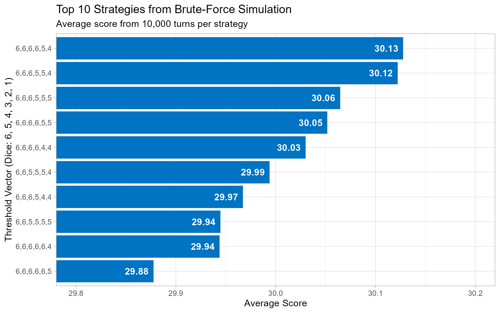
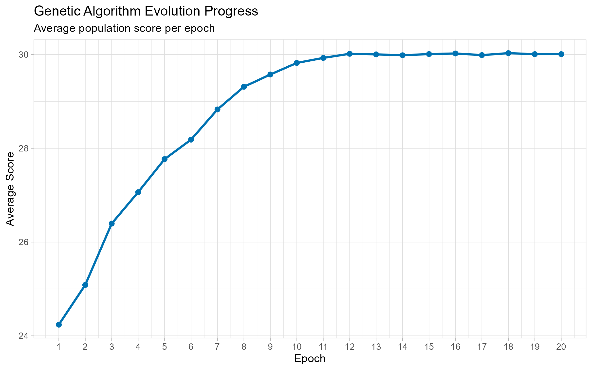

# Thirties: Finding the Optimal Strategy in a Dice Game 🎲

This R project explores optimal strategies for the dice game "Thirties" using simulation and optimization techniques. It demonstrates skills in R programming, Monte Carlo simulation, probability (order statistics), and genetic algorithms.

---

## 🏆 Key Finding: The Optimal Strategy 🏆

The analysis identified the optimal strategy as using the threshold vector **`[6, 6, 6, 5, 5, 4]`**.

This means a player should keep dice with the following minimum values based on how many dice they are rolling:
* Roll 6 dice: Keep only 6s.
* Roll 5 dice: Keep only 6s.
* Roll 4 dice: Keep only 6s.
* Roll 3 dice: Keep 6s and 5s.
* Roll 2 dice: Keep 6s and 5s.
* Roll 1 die: Keep 6s, 5s, and 4s.

*(If a roll yields no dice meeting the threshold, the single highest die must be kept).*

This strategy yields an average score of approximately **30.10** per turn (based on 1 million simulated turns).

---

## 📖 The Game: Thirties

* Players start with 30 lives.
* On their turn, a player rolls 6 dice.
* They *must* set aside at least one die after each roll.
* They re-roll the remaining dice, repeating the process until all dice are set aside.
* **Goal:** Maximize the sum of the set-aside dice.
* **Scoring Impact (Simplified):** Scores > 30 benefit the player, scores < 30 penalize them. This analysis focuses purely on maximizing the score.

---

## 🛠️ Methodology

Two primary methods were used to find the optimal strategy:

1.  **Brute-Force Simulation:**
    * Leveraging insights from order statistics (calculating expected maximums), the search space was limited to 28 sensible, non-increasing threshold vectors using values \[4, 5, 6].
    * Each strategy was simulated 10,000 times to estimate its average score. The top strategies were simulated 1,000,000 times for higher precision.

2.  **Genetic Algorithm (GA):**
    * Implemented as a more scalable optimization approach and to validate the brute-force findings.
    * The GA population consisted of potential threshold vectors (chromosomes).
    * Fitness was determined by the average score from simulating turns using that vector.
    * The GA evolved over 20 epochs, using tournament selection, crossover, and mutation.

---

## 📊 Results

### Brute-Force Simulation Results

The brute-force simulation identified the top-performing strategies:

### Genetic Algorithm Evolution

The GA successfully converged towards the same optimal strategy found by the brute-force method, demonstrating its effectiveness. The plot below shows the average population score improving over epochs:

*(Note: The final score from the GA may differ slightly from brute-force due to fewer simulations per evaluation used for efficiency.)*

---

## 🔬 Full Analysis Report

For the detailed methodology, code implementation, probability theory, and complete results, please see the full R Markdown report:

* **[View the Full Report (Thirties.html)](Thirties.html)**

---

## 🚀 How to Run

1.  Clone this repository.
2.  Open `Thirties.Rmd` in RStudio.
3.  Ensure you have the necessary R packages installed (`ggplot2`).
4.  Click the "Knit" button in RStudio to run the analysis and generate the `Thirties.html` report. The plots will also be saved as PNG files.
